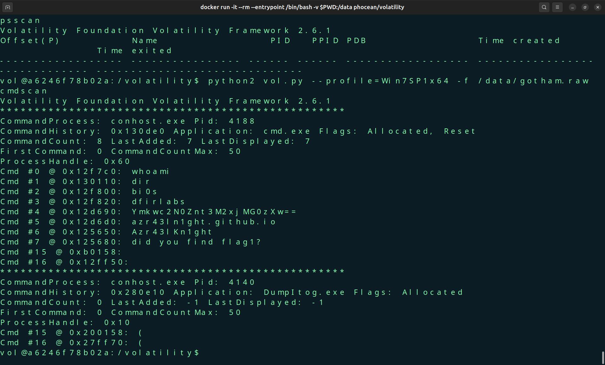
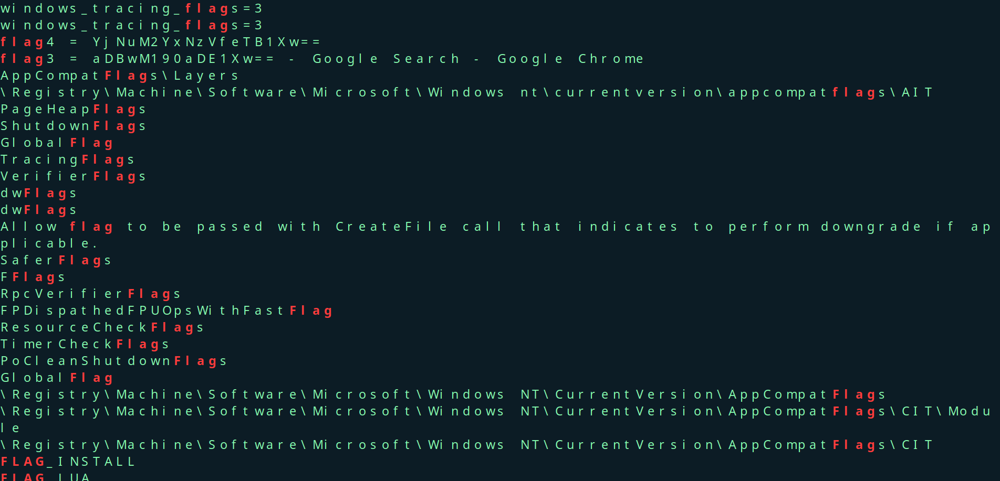
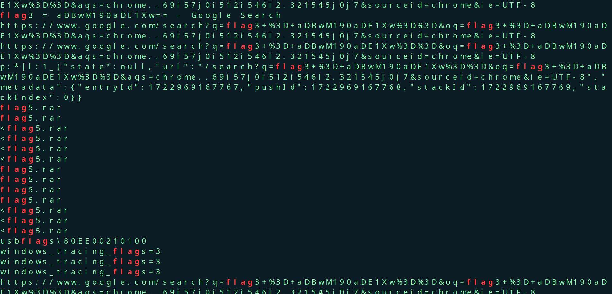

# Gotham Hustle

-  Given in the question was a 4.8GB gotham.raw file which was a windows memory dump
- Used volatility2 to extract the data but could not run it directly on my machine as it was not supported on ubuntu 24.04 , had to run things inside a docker container containing volatility2 which caused a lot of issues in between.
- We then determine the profiles present in the file
- - Next up do a command scan and then check the active processes in the memory dump

- We notice a weird base64 looking string in the output, on decoding the string `Ymkwc2N0Znt3M2xjMG0zXw==` we get the first part of the flag , i.e.
### flag1:`bi0sctf{w3lc0m3_`

- After this I tried listing the active process (pslist) and noticed multiple chrome windows, notepad ,mspaint and many other processes.
- Tried dumping the memory of notepad using the command below and find the strings matching with "flag" 
```bash
python2 vol.py --profile=Win7SP1x64 -f /data/gotham.raw memdump -p 2592 -D .

strings -el 2592.dmp | grep -i "flag"
```





- In the image , we can see strings flag3 and flag4 assigned to something which looks like base64 again so we decode and see if they match 

- Flag3 is`aDBwM190aDE1Xw==  ` which on decoding becomes `h0p3_th15_`
- Flag4 is `YjNuM2YxNzVfeTB1Xw==` which becomes `b3n3f175_y0u_`

- On scrolling down in the same output we find multiple .rar files have the name flag5 which indicated that the fifth part might be in one of these zip files 


```bash
vol@085c08d52010:/tmp$ python2 /volatility/vol.py -f /data/gotham.raw --profile=Win7SP1x64 filescan | grep -i flag5 Volatility Foundation Volatility Framework 2.6.1 0x000000011fdaff20 16 0 -W-r-- \Device\HarddiskVolume2\Users\bruce\Desktop\flag5.rarp\VirtualBox Dropped Files\2024-08-06T18_36_43.522668500Z\flag5.rar
```
- On trying to open the file, we find that it has a password which is same as the user's password, till now the user was bruce, so on checking the hash for user bruce we find that the password was batman using rockyou.txt
- The .rar file then gives the part 5 in the same base64 encoded format
- On decoding we get 
`m0r3_13337431}` as `Flag5`

The part 2 of the flag could not be properly found as I got stuck with the mspaint 

### On combining these parts we get 
`bi0sctf{w3lc0m3_part2_h0p3_th15_b3n3f175_y0u_m0r3_13337431}`


