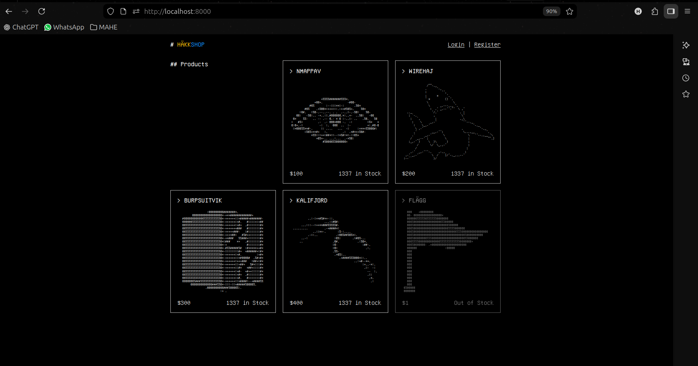

# Challenge 3

Given in the handout
- php website , looks like an online shop 

- The flag item is out of stock, looking at the given source files we see a flag.php file in it, examine that first to check what is happening
- Includes 2 other files perms and required and then enforce_auth().
- if the has_perms('flag_read') returns true then the flag is printed so need to find a way to make it true

