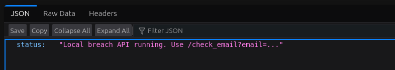

# IIT Bombay TrustLab CTF writeups


## N00b Randomness
###
- Given code 
```py
#!/usr/bin/env python3
 import binascii
 import secret
 
 
 def _step(x, y, z):
 return (x * z + y) & 0xFF
 
 
 def _mask_bytes(payload: bytes, x: int, y: int, seed: int) -> bytes:
 s = seed & 0xFF
 out = bytearray()
 for b in payload:
 s = _step(x, y, s)
 out.append(b ^ s)
 return bytes(out)
 
 
 def main():
 msg1, msg2, flag, A, C, SEED = secret.get_secret_material()
 
 ct1 = _mask_bytes(msg1, A, C, SEED)
 ct2 = _mask_bytes(msg2, A, C, SEED)
 ct3 = _mask_bytes(flag, A, C, SEED)
 
 print("PLAIN1_HEX =", msg1.hex())
 print("CIPH1_HEX =", ct1.hex())
 print("CIPH2_HEX =", ct2.hex())
 print("CIPH3_HEX =", ct3.hex())
 
 
 if __name__ == "__main__":
 main() PLAIN1_HEX = 57656c636f6d6520746f206d7920756c7472612073656375726520656e6372797074696f6e2073657276696365210a54686973206d6573736167652069732066756c6c79206b6e6f776e20746f20796f752e0a537572656c7920796f752063616e6e6f7420627265616b206d792074686973206369706865722e2e2e0a CIPH1_HEX = c6956bf53271f6a2dda7bf830cd45eb6b5d25666fea9a047ab1deffbcbc729f381240e99d35c80877b5e962db075816e4969e486804950e158bf4ade6c779b8c24dcab2f3db73d2d1ee67fda5a9492f5f44efd5538fee69ee018f6311044782bdf7e48c25d5ec1c7a8839f63ec343f9288b37705c49c8b378bb6c190cf CIPH2_HEX = d0d06bf93a3cf6ecddbae6d4558158bfb39d562ae4afa612b81bbbf7caca66e69e370e989d0f87837d5d8c739a1f817b016cf8c1cd494de64ba115de7077de986cd2a8343dbd303600e7319340c487f5e004d77539edf787ea05c91f2c28111ed97554d35d5dc1c7e982ca7de134299593a939018d808c358ab6cff0aab013c37f17a762b2bc60674c68770b87118550 CIPH3_HEX = e58272e5297fe7e4d2b1af9b2a901bb4b5ff0430bea29c5cea4babc197fb39d5823d5384c923c7bd7d40ce7ba8
 ```

 


 ### Flag:
 `trustctf{y0u_d0nt_3v3n_n33d_2_b_sm4rt_4_th15}`
   


## Breached
### Description

```
The email of the admin of Acme surveys has been breached in a recent data leak. However, no-one, not even the Acme employees know who is the admin of Acme. Fortunately, the generous developers of HaveIBeenChowned have provided us with an endpoint at https://tlctf2025-hibc.chals.io/ to help us with our quest.

Your task should you choose to accept it is to figure out the secret of the admin.
```

The link to the website was also given along with this along with files needed for running the website locally.A .env file was provided which contained FLAG_SECRET and ADMIN_API_KEY.  
A csv file was also provided which contained all the email addresses of employees of the company.  


- On going to the API endpoint given, we find 


- On entering email addresses we get to know if the provided address was a part of the data leak or not.
- The email addressed of employees can be found in the csv file which was uploaded.
- The server.py file provided helps in understanding how the server functions on the backend of the website.
- The challenge uses HMAC( Hash Based Message Authentication Code) which takes a key and a message.If the key is unknown then we can not forge the HMAC.  
The code snippet given :
```py
token_for_email(email) = HMAC_SHA256(FLAG_SECRET, email)
if hmac.compare_digest(token_for_email(email), FLAG_TOKEN):
    matched = True
```
From this we understand that the generated hash is computed with a FLAG_TOKEN which exists in the system.  

From the premise of the question it is clear that the FLAG_TOKEN is generated from the admin of the organisation.

So now we have to find the email which was part of the data breach.  
- There are 499 emails given, we gmake a script which  bruteforces all the emails at the API endpoint given, when the **pwned** value turns true we know that it was involved in the breach and is the admin's email.


```py


```

- From this we find that the admin email was blake.baker20@acme.test . Using this email and generating the hash for this, we can log into the website where the flag is displayed.

### Flag:
`trustctf{aefefb18de55}`


## Telegrammatic Induction
- Introductory flag, provided directly in the telegram group

### Flag:
`trustctf{l3t_th3_g4me5_b3g1n_ar3_y0u_r34dy_f0r_1t?}`


