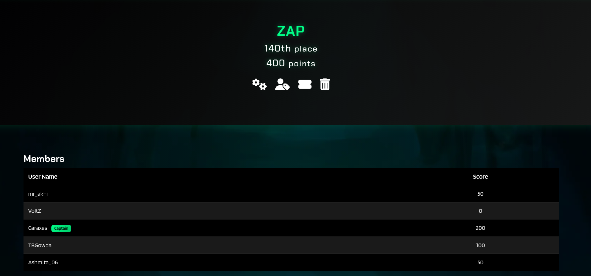
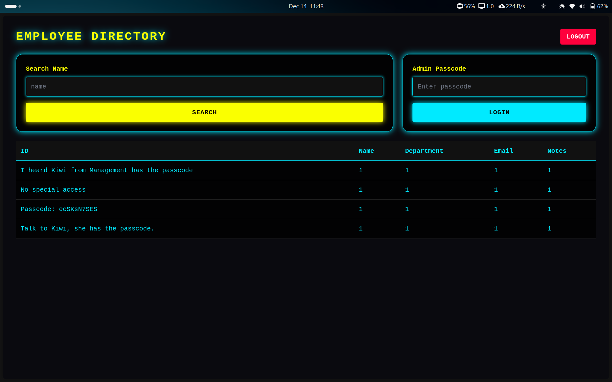
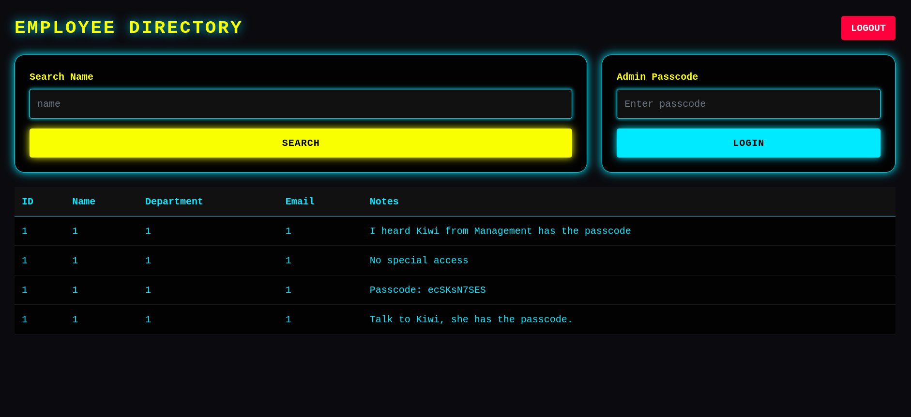
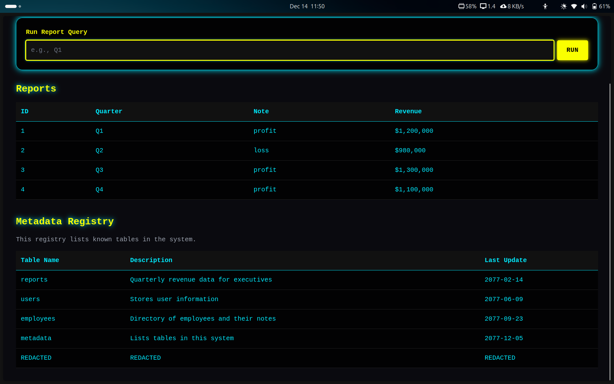
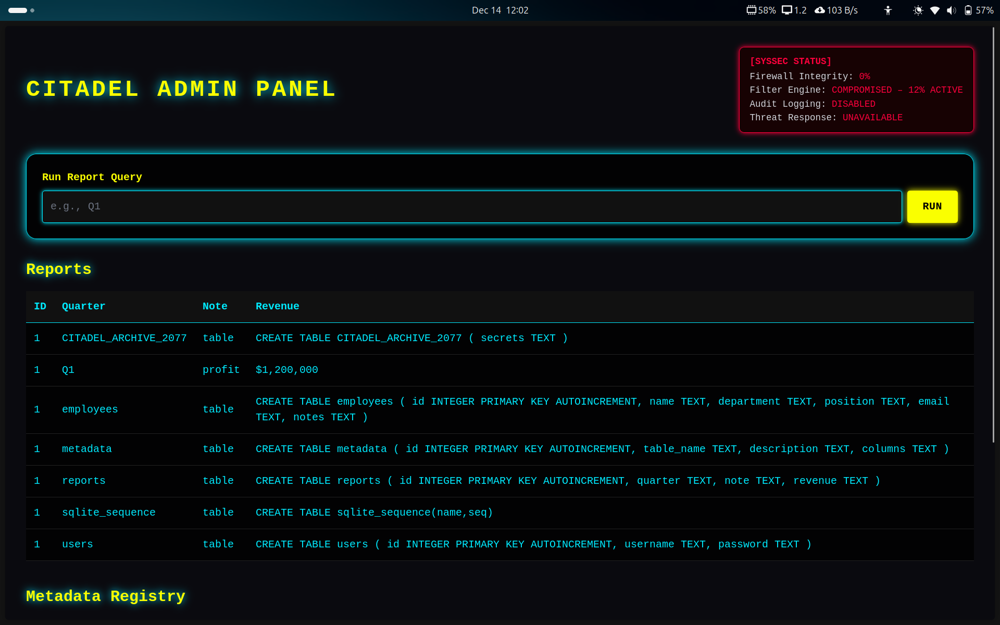
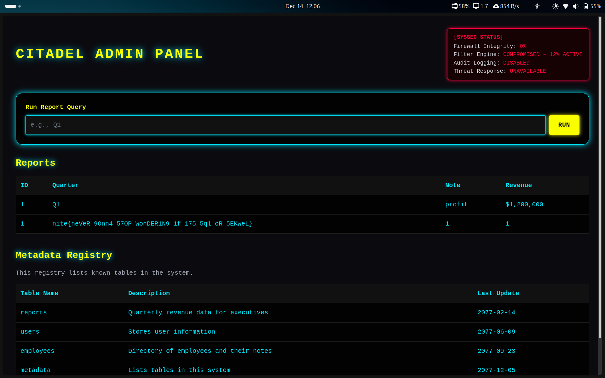

# NiteCTF writeups



### 
     Teamname :ZAP
     Username : Caraxes


### Solves:
    Antakshari
    Floating Point Guardian
    Database Reincursion


## Antakshari
``` 
My friend can never remember movie names, absolutely hopeless. This time he only recalls six cast members, nothing else. He's always been dense, but we've been a tight for years, so I guess I'm stuck helping him again. Can you figure out the movie he's trying to remember? 
```
- We were provided with 2 npy files, latent vectors and partial edges. 
- From the problem description, it is certain that a clustering algorithm is to be used to find the 6 "actor" nodes, so trying KNN for each node and finding 5 other nearest nodes should technically yield the 6 final nodes.
``` python
import numpy as np
from sklearn.neighbors import NearestNeighbors
from itertools import combinations

X = np.load("latent_vectors.npy")

k = 6
nbrs = NearestNeighbors(n_neighbors=k, metric="euclidean").fit(X)
distances, indices = nbrs.kneighbors(X)

best_cluster = None
best_score = float("inf")

for i in range(len(X)):
    cluster = indices[i]
    pts = X[cluster]

    # avg pairwise dist
    d = 0
    cnt = 0
    for a, b in combinations(range(k), 2):
        d += np.linalg.norm(pts[a] - pts[b])
        cnt += 1
    score = d / cnt

    if score < best_score:
        best_score = score
        best_cluster = cluster

print(best_cluster)
print("Avg intra-cluster distance:", best_score)
```

- This code yields the numbers 189,177,134,108,37and 29 which we input into the website to obtain the flag

### Flag: `nite{Diehard_1891771341083729}`


## Floating Point Guardian 
    Look at my digital gurdian. I built it using my custom made neural network written in C. Bad move? eh well. 
- The question provides a C file containing the code for the neural net which accepts 15 inputs and if the inputs provide the correct probability value then we get master access and thereby the flag.

- The correct input values for each question were 4.129455695279808  
-0.4366957673093932  
-3.796971544137412  
-2.7699815118090494  
-2.3963940458962782  
0.03173315622151961  
0.08688139670427274  
-4.154913327464644  
-2.1132984457353063  
-4.925254675028944  
0.2533229333401748  
5.2278722741772095  
4.731035695419174  
0.7403547814982929  
-2.78695592212719  


### Flag:`nite{br0_i5_n0t_g0nn4_b3_t4K1n6_any1s_j0bs_34x}`


## Database Reincursion
    First day as an intern at Citadel Corp and i'm already making strides!  

    Got rid of that bulky unnecessary security system and implemented my own simple solution. 
`https://database.chals.nitectf25.live/`

- The website seemed similar to the one in citadelCTF so tried the same SQLi command but it did not log me in
- Tried different combinations of inputs based on the error which I got.
- Tried UNION SELECT inputs as welll, finally got in when I put   
` 'UNION SELECT 1,hex(123),3`
- Used hex(123) as it would bypass filter (hoped for it to bypass which it did) and arrived on this page

- Then used `'UNION SELECT 1,1,1,1,Notes from Employees/*` and landed on 


- Input the passcode to get to the metadata registory 


- Used `Q1' UNION SELECT
1,
name,
type,
sql
FROM sqlite_master--` to get through to the db table info

- We can see that the cyberpunk2077 table has  (secrets TEXT) so we then use `Q1'UNION SELECT 1,secrets,1,1 FROM CITADEL_ARCHIVE_2077/* ` which gets us to the final table containing the flag



### Flag:`nite{neVeR_9Onn4_57OP_WonDER1N9_1f_175_5ql_oR_5EKWeL}`